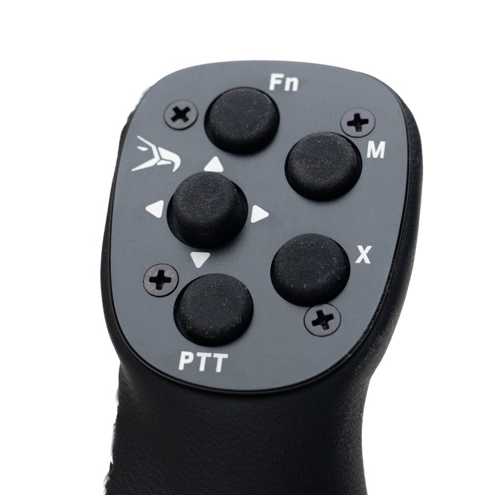

# Stick Remote Control (SteFly)

Arduino sketch for Stefly remote stick. 
You can see photos of the stick and button layout here:: **[SteFly Remote Stick](https://www.stefly.aero/product/stefly-leather-remote-stick)**  
History of detailed developing description you can find **[here](History.md)!**
### (SteFly-)Layout Overview

<b>
<table style="font-family:Arial" border="0">
  <tr>
  <td>
    
  </td>
  <td width=100>
  </td>
  <td>
    <table>
       <tr>
         <td width=20> </td><td width=20> </td><td width=20>1</td><td width=20> </td><td width=20> </td><td width=20> </td>
       </tr>
       <tr>
         <td> </td><td>5</td><td> </td><td>2</td><td> </td><td> </td>
       </tr>
       <tr>
         <td>7</td><td>0</td><td>8</td><td> </td><td> </td><td> </td>
       </tr>
       <tr>
         <td> </td><td>6</td><td> </td><td>3</td><td> </td><td> </td>
       </tr>
       <tr>
         <td> </td><td> </td><td>4</td><td> </td><td> </td><td> </td>
       </tr>
    </table>
  </td>
  </tr>
</table>

</b>

  * <b>1 (Fn)</b> : switches between mouse and keyboard emulation, **a long pressure ( > 1 Sec) sends a 'E' - could be managed as PilotEvent**
     in the XCSoar/OpenSoar - or to another user defined event in the xci-file
  * <b>2 (M)</b> : call the QuickMenu ('F1'), long pressure (> 1 sec) Audio/Vario-Menu ('M')
  * <b>3 (X)</b> : is ESC, **a long pressure calls the Quit program command ('Q'), and a very long pressure ( > 4 sec) sends a 'X' - can be used as exit command or for a shutdown event**
  * <b>4 (PTT)</b> : is an additional button connected to the PTT (not managed by the RemoteControl itself)
  * <b>5</b> (up), <b>6</b> (down), <b>7</b> (left), <b>8</b> (right) :  are arrow keys **with an accelerated movement after 1 second of continuous pressure**
  * <b>0</b> : is Enter, **a long pressure (> 1 sec) should reset the RemoteStick!**
  * <b>9 (STF)</b> (out of this layout): is a button (backside of stick) for toggling between Vario and STF (Speed-to-Fly) mode

